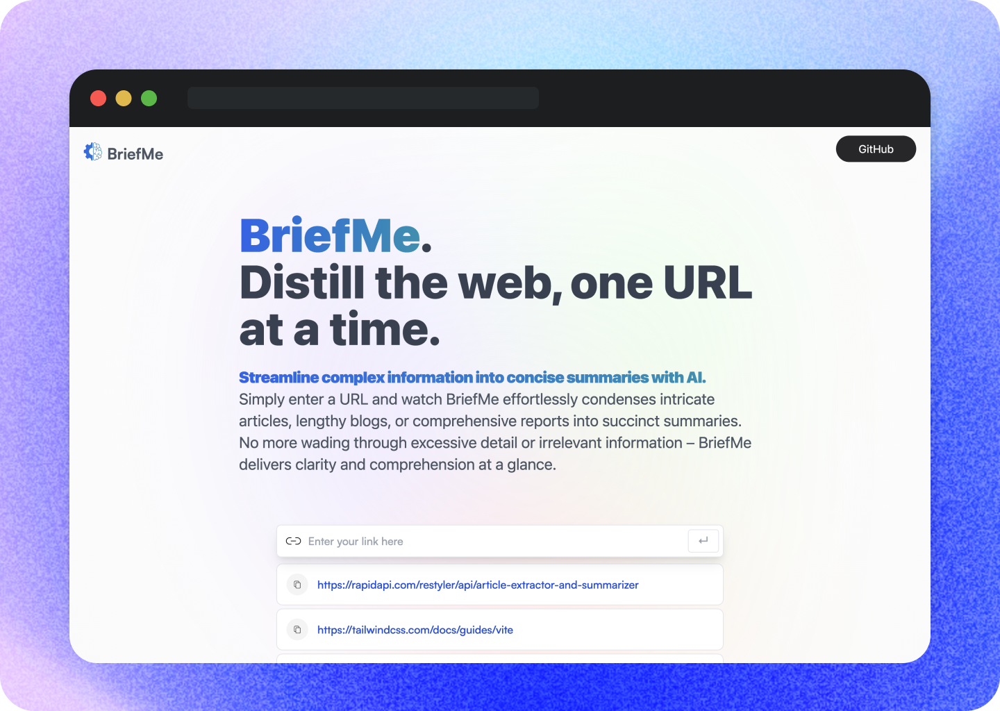

# BriefMe 

## [Live Demo](https://brief-me-jr.netlify.app/)
### brief-me-jr.netlify.app

## Description

Experience the future of information processing with BriefMe, an AI-driven tool that revolutionizes how we consume content. By transforming intricate articles, comprehensive reports, or lengthy blogs into succinct summaries with a single URL, BriefMe delivers clarity and comprehension instantly.

Leveraging Rapid API's Article Extractor and Summarizer, BriefMe extracts and distills key points from a plethora of news articles. This powerful API, coupled with the efficient GPT (Generative Pre-trained Transformer), ensures highly accurate and contextually apt summaries.

Built with React, styled with Tailwind CSS, and constructed with Vite. This project represents an elegant fusion of advanced technologies, demonstrating both technical aptitude and a commitment to creating impactful, user-oriented solutions.

## Features

- Extract articles from URLs
- Quickly summarize lengthy content

## Built With

- Rapid API's Article Extractor and Summarizer
- React
- Tailwind CSS
- Redux Toolkit

## Contributing

This project is open for contributions. Here are some ways you can contribute:
- Reporting bugs
- Suggesting new features
- Adding tests
- Improving documentation or design

## Contact

Project maintained by Joshua Ramat.
- Email: ramatjoshua@gmail.com
- Website: [joshuaramat.com](https://joshuaramat.com)

## Credits & Acknowledgements

Designs inspired by [dub.sh](https://dub.sh) – all credits go to them!
